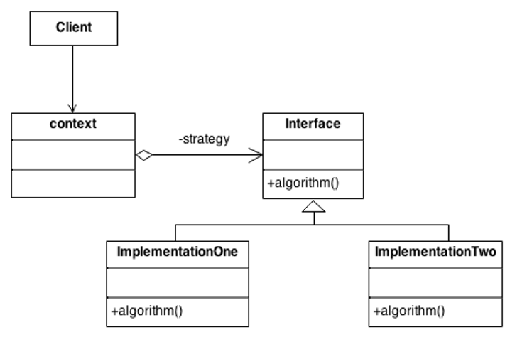

# Strategy Pattern

### 스트래티지 패턴의 핵심
- 알고리즘군(바뀌는 부분)을 **캡슐화** -> 나중에 바뀌지 않는 부분에 영향을 미치지 않고 그 부분만 고치거나 확장할 수 있음 == OCP
- How? 상속보다는 **구성**(composition)을 활용

### 사용된 디자인 원칙
- 바뀌는 부분은 캡슐화한다.
- 구현이 아닌 인터페이스에 맞춰서 프로그래밍한다.
- 상속보다는 구성(composition)을 활용한다.

## 상속에 대하여
- 수퍼클래스에 특정 메소드가 추가되면서 일부 서브클래스에 적합하지 않은 행동이 전부 추가될 수 있다.
- 이게 왜?
- 수퍼클래스를 수정하면 서브클래스들을 모두 살펴보고 오버라이드 해야 하는 불상사가 생길 수 있다.

### 상속을 사용할 때 단점
- 서브클래스에서 코드가 중복된다.
- 실행시에 특징을 바꾸기 힘들다.
- 모든 서브클래스의 행동을 알기 힘들다.
- 수퍼클래스 코드 변경시 서브클래스에 원치 않은 영향을 끼칠 수 있다.

